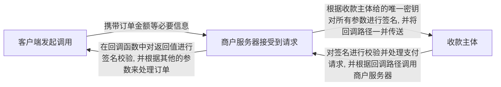

# 支付流程

最近对接了不少支付相关的业务, 也遇到了很多问题, 今天特此来做一个复盘。

首先来总结一下支付流程:

这是一个非常简单的支付流程图, 省略了所有不必要的细节, 其中在校验签名部分, 有不同的方式可以校验, 第一种就是流程图中呈现的, 商户需要在收款方注册账号并生成唯一密钥, 在商户服务器和收款方服务器来回传参的过程中, 都需要根据签名来进行校验。

另外一种, 是让商户自己来生成一个私钥和公钥, 在收款方服务器中将公钥填写进去, 并生成一个收款方的公钥。在每次传参的过程中, 将应用私钥和收款方公钥携带进参数中, 这样也保证了支付的安全性。在回调部分中, 直接校验商户id(商户在收款方注册时会有一个唯一值)和订单号来确定商户和订单。

<!--more-->

# 遇到的问题

我在对接收款方通道时, 遇到了一些问题:

* app 如何对接 h5 网站的支付方式?
* 当遇到了在成功之外的情况应该如何处理?

## app 如何对接 h5 网站的支付方式?

由于 app 原生的通道非常之少, 大部分都是给 h5 网站对接的通道, 所以就会遇到这种问题。
那么流程是这样的:

app 向商户服务器发起支付请求 -> 商户服务器收到请求后, 使用 HttpUrlConnection 对收款方服务器进行请求 -> 收款方服务器收到请求后会返回一段自动提交的 html 表单返回给商户服务器

到这里, 似乎就有点问题了, 服务器拿到一段 html 应该怎么办呢? 直接处理? 还是啥也不管直接返回给 app ? 那 app 拿到 html 应该怎么办? 我自己考虑有两种解决方式:

第一种: 在服务器中搞一个文件, 将这一段 html 写入到文件中, 然后将该文件的路径返回给 app, 这样 app就可以直接根据这个路径跳转到浏览器, 让浏览器去处理了。
第二种: 使用 jsoup 来处理 html 中的表单中的参数, 将参数提取出来, 然后继续使用 HttpUrlConnection 来模拟 http 请求, 直到拿到最后的支付路径。将路径传给 app 在去跳转。

这两种方式都可以, 但是我比较推荐第一种, 因为采用第二种方式, 在后台处理的时间会变得很长, 用户等待的时间也变得很长。

## 当遇到了在支付成功之外的情况应该如何处理?

我在对接一个通道的时候就遇到了一个情况, 这个通道不是支付通道, 是提现通道, 也就是说商户在账户中存钱, 用户有提现操作时进行提款。同样是 h5 的对接方式, 但是如果商户的账户中的款项不足时, 直接将错误信息返回给服务器, 而不是异步回调的方式来返回, 所以, 需要检测一下该情况。

